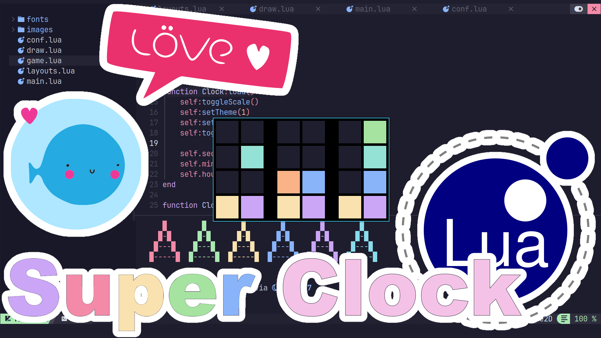

# Super Clock (Lua - Love2D)
A Binary Clock with 3 Layouts, 2 Themes, Color or Black & White. The Clock displays the Hours, Minutes, and Seconds each as 8 bits.

# Run
You will need to make sure Love2D is installed.

ArchLinux instructions.
```
sudo pacman -S --needed love
cd
git clone https://github.com/ProgrammingRainbow/Super-Clock-Love2D
cd Super-Clock-Love2D
love .
```
# Controls
1 to 6 - Themes and Layouts. \
c - Toggles Color mode. \
b - Toggles Big Mode. \
Space - Displays Time in Title for 5 seconds. \
Escape - Close Clock.
